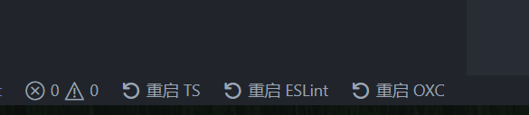
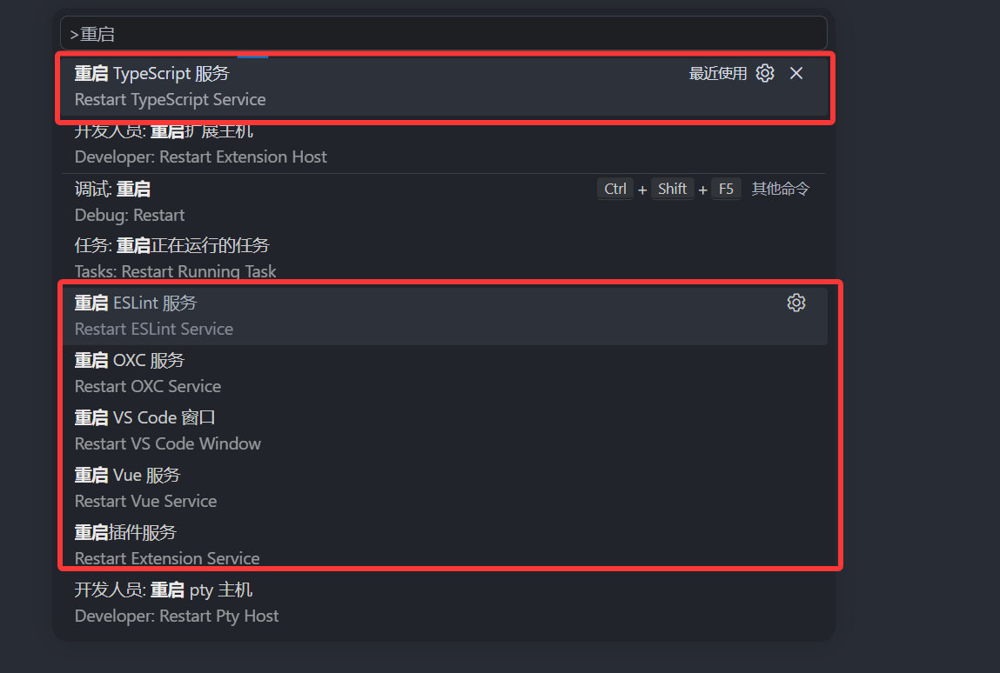
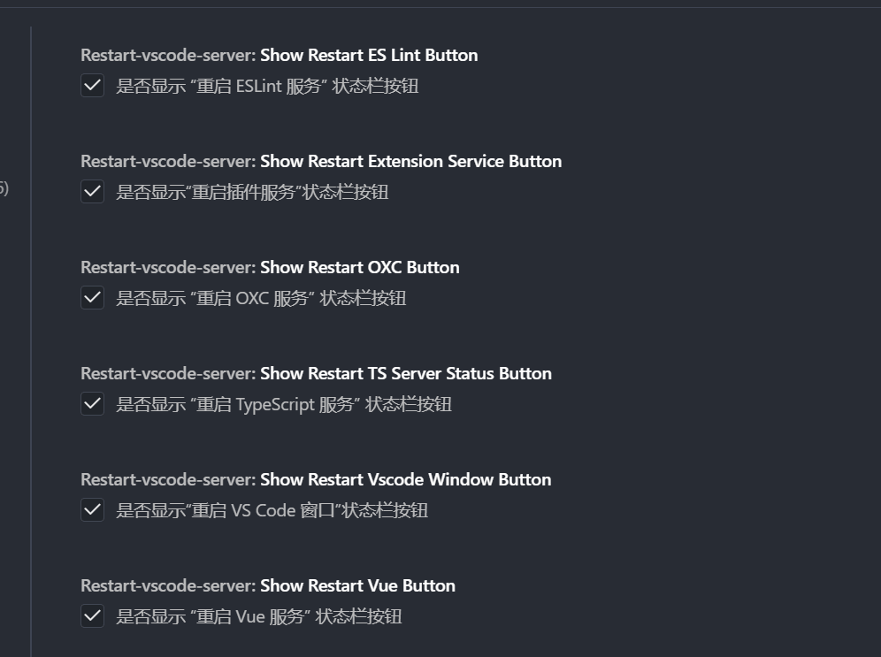

# restart-vscode-server

`restart-vscode-server` 是一个轻量的 VS Code 扩展，用于快速重启常见语言服务与编辑器相关服务，减少因为缓存、配置更新或服务异常导致的开发中断。

## 功能与命令

在 VS Code 中按 `Ctrl+Shift+P`（macOS 为 `Cmd+Shift+P`）打开命令面板后，可输入以下命令调用对应功能：

1. 重启 TypeScript 服务：`Restart TypeScript Service`
2. 重启 ESLint 服务：`Restart ESLint Service`
3. 重启 Vue 服务（兼容 Volar / Vetur）：`Restart Vue Service`
4. 重启 OXC 服务（Lint / Formatter）：`Restart OXC Service`
5. 重启 VS Code 窗口：`Restart VS Code Window`
6. 重启插件扩展服务（Extension Host）：`Restart Extension Service`

## 安装

你可以通过 VS Code 扩展市场搜索 `restart-vscode-server` 安装。


## 使用方式

### 状态栏按钮

扩展会在状态栏提供快捷按钮，支持一键重启服务。




### 命令面板

按 `Ctrl+Shift+P`（macOS 为 `Cmd+Shift+P`）打开命令面板，输入 `Restart` 或 `重启`，即可筛选并执行对应重启命令。



## 状态栏显示规则

为避免不必要的按钮干扰，部分按钮会根据项目上下文自动显示：

1. TypeScript：检测到 TS 文件或 `tsconfig/jsconfig` 后显示
2. ESLint：检测到 ESLint 配置后显示
3. Vue：检测到 Vue 文件且安装 Volar/Vetur 后显示
4. OXC：检测到 OXC 配置且安装 OXC 扩展后显示
5. 重启 VS Code 窗口：默认显示，可在设置中关闭
6. 重启插件扩展服务：默认显示，可在设置中关闭。适用于多个插件同时异常，或某些没有单独“重启服务”命令的插件出现故障时，通过重启 Extension Host 进行统一恢复。

## 反馈与共建

欢迎提交你希望支持“快速重启”的插件服务。你可以在仓库 `Issues` 中提出需求或建议：

- Issues: <https://github.com/mulingyuer/restart-vscode-server/issues>

## 配置项

你可以在 VS Code 设置中搜索 `restart-vscode-server`，或直接在 `settings.json` 配置：

```json
{
	// 是否显示“重启 TypeScript 服务”状态栏按钮
	"restart-vscode-server.showRestartTsServerStatusButton": true,

	// 是否显示“重启 ESLint 服务”状态栏按钮
	"restart-vscode-server.showRestartESLintButton": true,

	// 是否显示“重启 Vue 服务”状态栏按钮
	"restart-vscode-server.showRestartVueButton": true,

	// 是否显示“重启 OXC 服务”状态栏按钮
	"restart-vscode-server.showRestartOXCButton": true,

	// 是否显示“重启 VS Code 窗口”状态栏按钮
	"restart-vscode-server.showRestartVscodeWindowButton": true,

	// 是否显示“重启插件扩展服务”状态栏按钮
	"restart-vscode-server.showRestartExtensionServiceButton": true
}
```



## 鸣谢

本插件的开发受到了以下优秀项目的启发，并参考了其部分实现。在此向它们的作者表示诚挚感谢：

- 重启 TS 和 ESLint 服务插件：[Restart TS/ESLint Server](https://marketplace.visualstudio.com/items?itemName=acoreyj.restart-ts-eslint-server)
- 重启 VS Code 插件：[Reload](https://marketplace.visualstudio.com/items?itemName=natqe.reload)

## 相关资源

1. VS Code 内置图标库：[codicon](https://microsoft.github.io/vscode-codicons/dist/codicon.html)
2. 插件发布管理页面：[manage](https://marketplace.visualstudio.com/manage)
3. Open VSX 发布页面：[open-vsx](https://open-vsx.org/user-settings/extensions)
